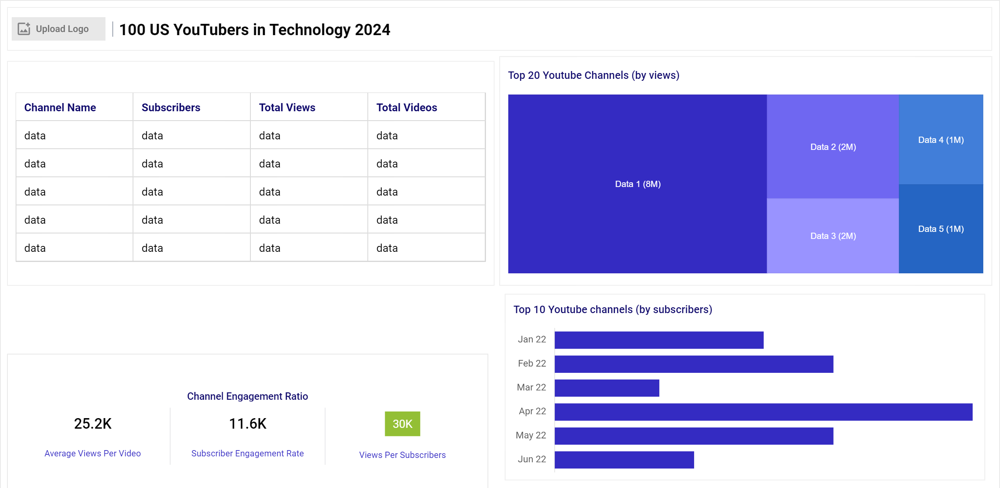
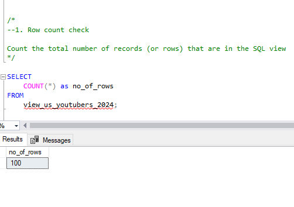
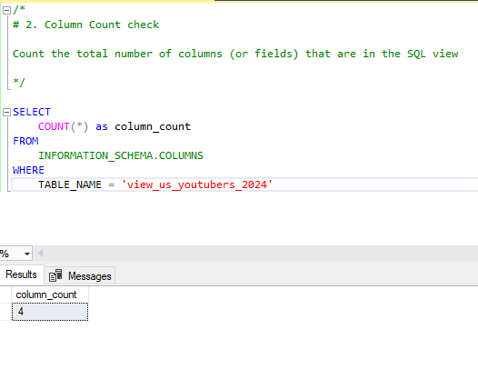
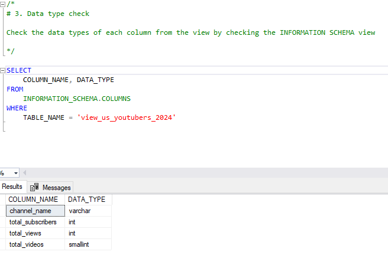
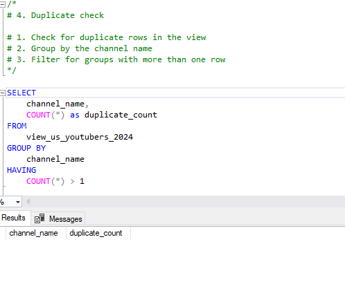
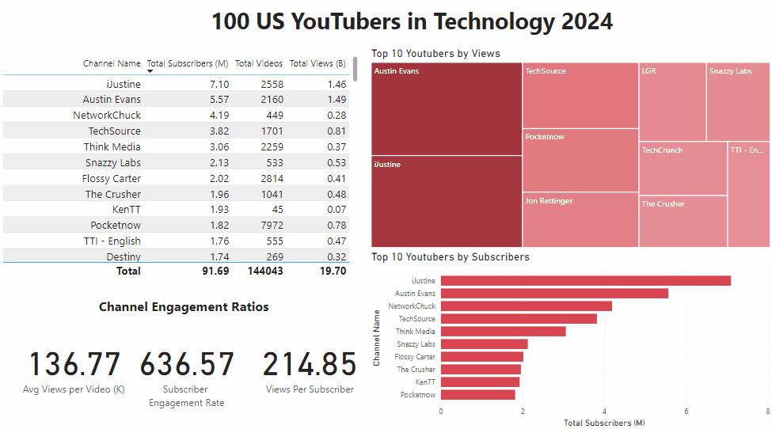
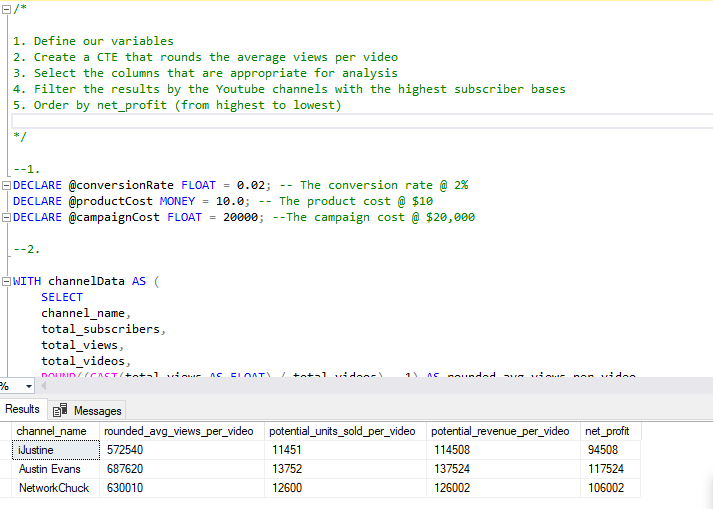
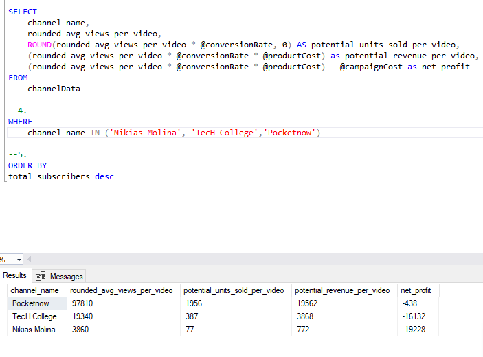
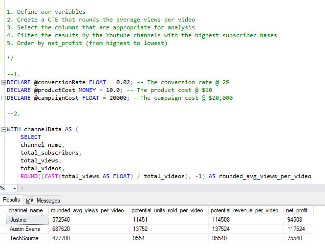

# Data Portfolio: Python to Power BI 


# Table of Contents

- [Objective](#objective)
- [Data Source](#data-source)
- [Stages](#stages)
  - [Design](#design)
  - [Mockup](#mockup)
- [Tools](#tools)
- [Development](#development)
- [Pseudocode](#pseudocode)
- [Data Exploration](#data-exploration)
- [Data Cleaning](#data-cleaning)
- [Transform the Data](#transform-the-data)
- [Create the SQL View](#create-the-sql-view)
- [Testing](#testing)
  - [Data Quality Tests](#data-quality-tests)
- [Visualization](#visualization)
  - [Results](#results)
  - [DAX Measures](#dax-measures)
- [Analysis](#analysis)
  - [Findings](#findings)
  - [Validation](#validation)
  - [Discovery](#discovery)
- [Recommendations](#recommendations)
  - [Potential ROI](#potential-roi)
  - [Potential Courses of Action](#potential-courses-of-action)
- [Conclusion](#conclusion)


# Objective

- What is the key pain point?

  The Head of Marketing wants to find the top 100 US-based technology YouTubers in 2024 to decide which YouTubers would be best for running marketing campaigns throughout the rest of the year.

- What is the ideal solution?  

To create a dashboard that provides insights into the top 100 US-based technology YouTubers in 2024, including:
  - Subscriber count
  - Total views
  - Total videos
  - Engagement metrics

This will help the marketing team make informed decisions about which YouTubers to collaborate with for their marketing campaigns.

## User Story

As the Head of Marketing, I want to use a dashboard that analyzes YouTube channel data in the US.

This dashboard should allow me to identify the top-performing channels based on metrics like subscriber base and average views.

With this information, I can make more informed decisions about which YouTubers are right to collaborate with, maximizing the effectiveness of each marketing campaign.

## Data Source

What data is needed to achieve our objective?

To achieve our objective, we require data on the top UK YouTubers in 2024, which includes:

- Channel names
- Total subscribers
- Total views
- Total videos uploaded

Where is the data coming from? The data has been compiled from various websites that track YouTube metrics and analytics. 

# Stages

- Design
- Development
- Testing
- Analysis


## Design

## Dashboard Components Required
What should the dashboard contain based on the requirements provided? 

To understand what it should include, we need to figure out what questions we need the dashboard to answer:

1. Who are the top 10 YouTubers with the most subscribers?
2. Which 3 channels have uploaded the most videos?
3. Which 3 channels have the most views?
4. Which 3 channels have the highest average views per video?
5. Which 3 channels have the highest views per subscriber ratio?
6. Which 3 channels have the highest subscriber engagement rate per video uploaded?

For now, these are some of the questions we need to answer; this may change as we progress in our analysis.

## Dashboard Mockup

- What Should It Look Like?

Some of the data visuals that may be appropriate in answering our questions include:

1. Table
2. Treemap
3. Scorecards
4. Horizontal bar chart





## Tools

| Tool         | Purpose                                               |
|--------------|-------------------------------------------------------|
| Excel        | Exploring the data                                   |
| SQL Server   | Cleaning, testing, and analyzing the data           |
| Power BI     | Visualizing the data via interactive dashboards      |
| GitHub       | Hosting the project documentation and version control |
| Mokkup AI    | Designing the wireframe/mockup of the dashboard      |


## Development

## Pseudocode

- What's the general approach in creating this solution from start to finish?

1. Get the data
2. Explore the data in Excel
3. Load the data into SQL Server
4. Clean the data with SQL
5. Test the data with SQL
6. Visualize the data in Power BI
7. Generate the findings based on the insights
8. Write the documentation and commentary
9. Publish the data to GitHub Pages


## Data Exploration Notes

This is the stage where you have a scan of what's in the data, errors, inconcsistencies, bugs, weird and corrupted characters etc


- What are your initial observations with this dataset? What’s caught your attention so far?

1. There are at least 4 columns that contain the data we need for this analysis, which signals we have everything we need from the file without needing to contact the client for any more data.
2. The first column contains channel IDs, which are separated by an @ symbol—we need to extract the channel names from this.
3. Some of the cells and header names are in a different language. We need to confirm if these columns are necessary, and if so, we need to address them.
4. We have more data than we need, so some of these columns will need to be removed.


## Data Cleaning

- What do we expect the clean data to look like?  (What should it contain? What contraints should we apply to it?)

The aim is to refine our dataset to ensure it is structured and ready for analysis. 

The cleaned data should meet the following criteria and constraints:

- Only relevant columns should be retained.
- All data types should be appropriate for the contents of each column.
- No column should contain null values, indicating complete data for all records.

Below is a table outlining the constraints on our cleaned dataset:

| Property         | Description |
|------------------|-------------|
| Number of Rows   | 100         |
| Number of Columns | 4          |

Here is a tabular representation of the expected schema for the clean data:

| Column Name        | Data Type | Nullable |
|--------------------|-----------|----------|
| channel_name       | VARCHAR   | NO       |
| total_subscribers  | INTEGER   | NO       |
| total_views        | INTEGER   | NO       |
| total_videos       | INTEGER   | NO       |

- What steps are needed to clean and shape the data into the desired format?

1. Remove unnecessary columns by only selecting the ones you need.
2. Extract YouTube channel names from the first column.
3. Rename columns using aliases.


### Transform the data

```sql
/*
# 1. Select the required columns
# 2. Extract the channel name from the 'NAME' column
*/

-- 1.

SELECT 
    CAST(SUBSTRING(NAME, 1, CHARINDEX('@', NAME) - 1) AS VARCHAR(100)) AS channel_name,
    total_subscribers,
    total_views,
    total_videos
FROM
    us_youtubers_2024;
```


```sql
/*
# 1. Create a view to store the transformed data
# 2. Cast the extracted channel name as VARCHAR(100)
# 3. Select the required columns from the us_youtubers_2024 SQL table 
*/

-- 1.
CREATE VIEW us_youtubers_2024 AS

-- 2.
SELECT
    CAST(SUBSTRING(NOMBRE, 1, CHARINDEX('@', NAME) - 1) AS VARCHAR(100)) AS channel_name, -- 2.
    total_subscribers,
    total_views,
    total_videos

-- 3.
FROM
    us_youtubers_2024;
```


# Testing

- What data quality and validation checks are you going to create?

Here are the data quality tests conducted:

## Row count check

/*
### Count the total number of records (or rows) are in the SQL view
*/

```sql
SELECT
    COUNT(*) AS no_of_rows
FROM
    view_uk_youtubers_2024;
```
### Output


## Column count check

### SQL query


```sql
/* 
# Count the total number of columns (or fields) are in the SQL view
*/

SELECT 
	COUNT(*) as column_count
FROM
	INFORMATION_SCHEMA.COLUMNS
WHERE
	TABLE_NAME = 'view_us_youtubers_2024'

```

### Output



## Data type check


### SQL query

```sql
/*
# Check the data types of each column from the view by checking the INFORMATION SCHEMA view
*/
SELECT 
	COLUMN_NAME, DATA_TYPE
FROM
	INFORMATION_SCHEMA.COLUMNS
WHERE
	TABLE_NAME = 'view_us_youtubers_2024'
```


### Output



## Duplicate count check


### SQL query

```sql
/*
# 1. Check for duplicate rows in the view
# 2. Group by the channel name
# 3. Filter for groups with more than one row
*/

SELECT 
	channel_name,
	COUNT(*) as duplicate_count 
FROM 
	view_us_youtubers_2024
GROUP BY
	channel_name
HAVING
	COUNT(*) > 1
```


### Output



# Visualization


## Results

- What does the dashboard look like?



## DAX Measures


### 1. Total Subscribers (M)

```dax
Total Subscribers (M) = 
VAR million = 1000000
VAR sumOfSubscribers = SUM(view_us_youtubers[total_subscribers])
VAR totalSubscribers = DIVIDE(sumOfSubscribers, million)

RETURN totalSubscribers
```

### 1. Total Views (B)

```dax
Total Views (B) = 
VAR billion = 1000000000
VAR sumOfTotalViews = SUM(view_us_youtubers[total_views])
VAR totalViews = DIVIDE(sumOfTotalViews, billion)
RETURN totalViews
```

### 3. Total Videos

```dax
Total Videos = 
VAR totalVideos = SUM(view_us_youtubers[total_videos])
RETURN totalVideos
```

### 4. Average Views Per Video (K)

```dax
Avg Views per Video (K) = 
VAR sumOfTotalViews = SUM(view_us_youtubers[total_views])
VAR sumOfTotalVideos = SUM(view_us_youtubers[total_videos])
VAR avgViewsPerVideo = DIVIDE(sumOfTotalViews, sumOfTotalVideos, BLANK())
VAR finalAvgViewsPerVideo = DIVIDE(avgViewsPerVideo,1000, BLANK())
RETURN finalAvgViewsPerVideo
```


### 5. Subscriber Engagement Rate

```dax
Subscriber Engagement Rate = 
VAR sumOfTotalSubscribers = SUM(view_us_youtubers[total_subscribers])
VAR sumOfTotalVideos = SUM(view_us_youtubers[total_videos])
VAR subscriberEngRate = DIVIDE(sumOfTotalSubscribers, sumOfTotalVideos, BLANK())
RETURN subscriberEngRate
```

### 6. Views Per Subscriber

```dax
Views Per Subscriber = 
VAR sumOfTotalVIews = SUM(view_us_youtubers[total_views])
VAR sumOfTotalSubscribers = SUM(view_us_youtubers[total_subscribers])
VAR viewsPerSubscriber = DIVIDE(sumOfTotalVIews,sumOfTotalSubscribers,BLANK())
RETURN viewsPerSubscriber
```

# Analysis


## Findings

- What did we find?

For this analysis, we're going to focus on the questions below to get the information we need for our marketing client

Here are the key questions we need to answer for our marketing client:

Who are the top 10 YouTubers with the most subscribers?
Which 3 channels have uploaded the most videos?
Which 3 channels have the most views?
Which 3 channels have the highest average views per video?
Which 3 channels have the highest views per subscriber ratio?
Which 3 channels have the highest subscriber engagement rate per video uploaded?


### 1. Who are the top 10 YouTubers with the most subscribers?


| Rank | Channel Name     | Subscribers (M) |
|------|------------------|------------------|
| 1    | iJustine         | 7.10M            |
| 2    | Austin Evans     | 5.57M            |
| 3    | NetworkChuck     | 4.19M            |
| 4    | TechSource       | 3.82M            |
| 5    | Think Media      | 3.06M            |
| 6    | Snazzy Labs      | 2.13M            |
| 7    | Flossy Carter    | 2.02M            |
| 8    | The Crusher      | 1.96M            |
| 9    | KenTT            | 1.93M            |
| 10   | Pocketnow        | 1.82M            |


### 2.Which 3 channels have uploaded the most videos?

| Rank | Channel Name     | Videos Uploaded    |
|------|------------------|--------------------|
| 1    | Nikias Molina     | 19,781            |
| 2    | TecH College      | 9,683             |
| 3    | Pocketnow         | 7,972             |


### 3. Which 3 channels have the most views?

| Rank | Channel Name     | Total Views (B)     |
|------|------------------|---------------------|
| 1    | Austin Evans      | 1.485              |
| 2    | iJustine          | 1.465              |
| 3    | TechSource        | 0.813              |


### 4. Which 3 channels have the highest average views per video?

| Channel Name      | Average Views per Video (M)    |
|--------------------|------------------------------ |
| Terry Lee White     | 3.53    		     |
| iLuvTrading         | 2.23      		     |
| Sky Creative HD     | 2.14                         |


### 5. Which 3 channels have the highest views per subscriber ratio?

| Rank | Channel Name          | Views per Subscriber      |
|------|-----------------------|---------------------------|
| 1    | Top 10 Zone           | 558.80  	           | 
| 2    | Internet Today        | 549.01  		   |
| 3    | This is Tech Today    | 548.75 		   |


### 6. Which 3 channels have the highest subscriber engagement rate per video uploaded?

| Rank | Channel Name        | Subscriber Engagement Rate   |
|------|---------------------|------------------------------|
| 1    | KenTT               | 42,888.89 		    |
| 2    | Terry Lee White     | 42,454.55 		    |
| 3    | Moment              | 18,095.24 		    |


#### Notes

For this analysis, we'll prioritize analysing the metrics that are important in generating the expected ROI for our marketing client, which are the YouTube channels wuth the most

- subscribers
- total views
- videos uploaded

## Validation

### 1. Youtubers with the most subscribers

#### Calculation breakdown

Campaign idea = product placement

a. Justine
   
- Average views per video: 572,540
- Product cost: $10
- Potential units sold per video: 572,540 x 2% conversion rate = 11,450.8 units sold
- Potential revenue per video: 11,450.8 x $10 = $114,508
- Campaign cost (one-time fee): $20,000
- **Net profit: $114,508 - $20,000 = $94,508**

b. Austin Evans
  
- Average views per video: 687,620
- Product cost: $10
- Potential units sold per video: 687,620 x 2% conversion rate = 13,752.4 units sold
- Potential revenue per video: 13,752.4 x $10 = $137,524
- Campaign cost (one-time fee): $20,000
- **Net profit: $137,524 - $20,000 = $117,524**

c. NetworkChuck
- Average views per video: 630,010
- Product cost: $10
- Potential units sold per video: 630,010 x 2% conversion rate = 12,600.2 units sold
- Potential revenue per video: 12,600.2 x $10 = $126,002
- Campaign cost (one-time fee): $20,000
- **Net profit: $126,002 - $20,000 = $106,002**

Best option from category: Austin Evans

#### SQL query

```sql
/* 

# 1. Define variables 
# 2. Create a CTE that rounds the average views per video 
# 3. Select the column you need and create calculated columns from existing ones 
# 4. Filter results by Youtube channels
# 5. Sort results by net profits (from highest to lowest)

*/

--1. 
DECLARE @conversionRate FLOAT = 0.02; -- The conversion rate @ 2%
DECLARE @productCost MONEY = 10.0; -- The product cost @ $10
DECLARE @campaignCost FLOAT = 20000; --The campaign cost @ $20,000

--2. 

WITH channelData AS (
	SELECT 
	channel_name,
	total_subscribers,
	total_views,
	total_videos,
	ROUND((CAST(total_views AS FLOAT) / total_videos), -1) AS rounded_avg_views_per_video
	
	
	FROM youtube_db.dbo.view_us_youtubers_2024 
)

SELECT 
	channel_name,
	rounded_avg_views_per_video,
	ROUND(rounded_avg_views_per_video * @conversionRate, 0) AS potential_units_sold_per_video,
	(rounded_avg_views_per_video * @conversionRate * @productCost) as potential_revenue_per_video,
	(rounded_avg_views_per_video * @conversionRate * @productCost) - @campaignCost as net_profit
FROM
	channelData

--4. 
WHERE
	channel_name IN ('iJustine', 'Austin Evans','NetworkChuck')

--5.
ORDER BY
total_subscribers desc
```


#### Output



### 2. Youtubers with the most videos uploaded

### Calculation breakdown

Campaign idea = sponsored video series

1. Nikias Molina

- Average views per video: 3,862
- Potential units sold per video: 77
- Potential revenue per video: $772
- Campaign cost: $20,000
- **Net profit: -$19,228 (loss)**

2. TecH College

- Average views per video: 19,344
- Potential units sold per video: 387
- Potential revenue per video: $3,869
- Campaign cost: $20,000
- **Net profit: -$16,131 (loss)**

3. Pocketnow
   
- Average views per video: 97,806
- Potential units sold per video: 1,956
- Potential revenue per video: $19,561
- Campaign cost: $20,000
- **Net profit: -$439 (loss)**

Best Option rom category : Pocketnow (Lowest loss: -$439)

#### SQL query

```sql
/*

1. Define our variables
2. Create a CTE that rounds the average views per video
3. Select the columns that are appropriate for analysis
4. Filter the results by the Youtube channels with the highest subscriber bases
5. Order by net_profit (from highest to lowest)

*/

--1. 
DECLARE @conversionRate FLOAT = 0.02; -- The conversion rate @ 2%
DECLARE @productCost MONEY = 10.0; -- The product cost @ $10
DECLARE @campaignCost FLOAT = 20000; --The campaign cost @ $20,000

--2.

WITH channelData AS (
	SELECT 
	channel_name,
	total_subscribers,
	total_views,
	total_videos,
	ROUND((CAST(total_views AS FLOAT) / total_videos), -1) AS rounded_avg_views_per_video
	
	
	FROM youtube_db.dbo.view_us_youtubers_2024 
)

SELECT 
	channel_name,
	rounded_avg_views_per_video,
	ROUND(rounded_avg_views_per_video * @conversionRate, 0) AS potential_units_sold_per_video,
	(rounded_avg_views_per_video * @conversionRate * @productCost) as potential_revenue_per_video,
	(rounded_avg_views_per_video * @conversionRate * @productCost) - @campaignCost as net_profit
FROM
	channelData

--4. 
WHERE
	channel_name IN ('Nikias Molina','TecH College','Pocketnow')

--5.
ORDER BY
total_subscribers desc
```


#### Output



### 3. Youtubers with the Most Views
   
Campaign Idea: Influencer marketing

1. Austin Evans
- Average views per video: 687,621
- Potential units sold per video: 13,752
- Potential revenue per video: $137,524
- Campaign cost: $20,000
- **Net profit: $117,524**
  
2. iJustine
- Average views per video: 572,537
- Potential units sold per video: 11,451
- Potential revenue per video: $114,507
- Campaign cost: $20,000
- **Net profit: $94,507**
  
3. TechSource
- Average views per video: 477,699
- Potential units sold per video: 9,554
- Potential revenue per video: $95,540
- Campaign cost: $20,000
- **Net profit: $75,540**

Best Option: Austin Evans (Highest net profit: $117,524)

#### SQL query
```sql
/*

1. Define our variables
2. Create a CTE that rounds the average views per video
3. Select the columns that are appropriate for analysis
4. Filter the results by the Youtube channels with the highest subscriber bases
5. Order by net_profit (from highest to lowest)

*/

--1. 
DECLARE @conversionRate FLOAT = 0.02; -- The conversion rate @ 2%
DECLARE @productCost MONEY = 10.0; -- The product cost @ $10
DECLARE @campaignCost FLOAT = 20000; --The campaign cost @ $20,000

--2.

WITH channelData AS (
	SELECT 
	channel_name,
	total_subscribers,
	total_views,
	total_videos,
	ROUND((CAST(total_views AS FLOAT) / total_videos), -1) AS rounded_avg_views_per_video
	
	
	FROM youtube_db.dbo.view_us_youtubers_2024 
)

SELECT 
	channel_name,
	rounded_avg_views_per_video,
	ROUND(rounded_avg_views_per_video * @conversionRate, 0) AS potential_units_sold_per_video,
	(rounded_avg_views_per_video * @conversionRate * @productCost) as potential_revenue_per_video,
	(rounded_avg_views_per_video * @conversionRate * @productCost) - @campaignCost as net_profit
FROM
	channelData

--4. 
WHERE
	channel_name IN ('Austin Evans', 'iJustine','TechSource')

--5.
ORDER BY
total_subscribers desc
```

#### Output



## Discovery
- What did we learn?
  
We discovered that

1. iJustine, Austin Evans, and NetworkChuck are the channels with the most subscribers in our dataset.
2. Nikias Molina, TecH College, and Pocketnow are the channels with the most videos uploaded.
3. Austin Evans, iJustine, and TechSource are the channels with the most views.
4. Channels with large subscriber bases like iJustine and Austin Evans consistently generate high views, making them strong candidates for brand exposure.
5. While some channels like Nikias Molina upload content frequently, they have lower average views per video, suggesting that volume doesn't always correlate with higher reach.
6. Channels like KenTT have high subscriber engagement per video uploaded, indicating a loyal and active follower base, even if they have fewer views overall.

## Recommendations

 - What do you recommend based on the insights gathered?

1. Austin Evans is the best YouTube channel to collaborate with for maximizing visibility, as this channel has both a high subscriber count and consistently high average views per video, offering strong reach and engagement potential.
2. Although Nikias Molina and TecH College are frequent content creators, their lower average views per video suggest that investing in collaborations with them may not offer the best return on investment.
3. Channels like KenTT, with high engagement rates, should be considered for campaigns targeting loyal, active audiences, especially if maintaining long-term brand recognition is a goal.
4. Pocketnow, while a frequent publisher, may offer better value for budget-conscious campaigns due to its smaller losses when factoring in campaign costs.

The top 3 channels to form collaborations with are Austin Evans, iJustine, and KenTT based on their high visibility, engagement, and potential reach.

## Potential ROI

 - What ROI do we expect if we take this course of action?

1. A product placement campaign with Austin Evans could yield a net profit of $117,524 per video, offering excellent returns for high-exposure campaigns.
2. Collaborating with iJustine for influencer marketing could result in a net profit of $94,507 per video, making this another valuable option for maximizing reach.
3. Partnering with KenTT for a highly engaged audience might not yield the highest immediate net profit, but it could lead to strong brand loyalty and long-term value.

## Action plan

 - What course of action should we take and why?

Based on our analysis, we recommend moving forward with a long-term partnership deal with Austin Evans to promote the client's products, as this channel offers the highest potential visibility and ROI.

We'll keep iJustine and KenTT as secondary options to target specific audiences, focusing on high engagement and consistent reach.

 - What steps do we take to implement the recommended decisions effectively?

a. Reach out to the teams behind Austin Evans, iJustine, and KenTT to initiate partnership discussions.
b. Negotiate contracts within the allocated budget for each campaign and finalize details.
c. Launch the campaigns, track their performance using agreed-upon KPIs, and monitor conversions closely.


